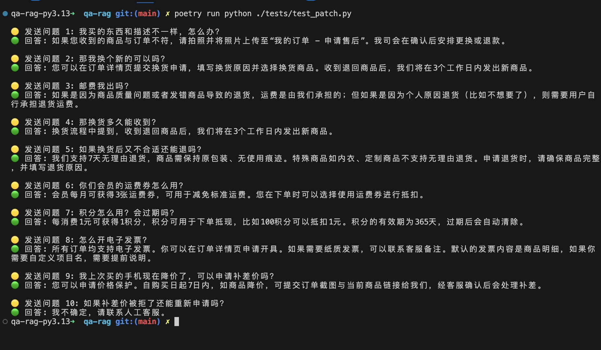

# QA-RAG (Question Answering with Retrieval-Augmented Generation)

## 概述

QA-RAG 是一个基于检索增强生成（Retrieval-Augmented Generation）的问答系统。该系统利用向量数据库和语言模型来回答用户的问题。通过结合检索和生成的方法，QA-RAG 能够提供更准确和相关的答案。

## 主要功能

- **检索增强生成**：结合向量数据库和语言模型来生成高质量的答案。
- **多轮对话支持**：支持多轮对话历史，提供上下文相关的回答。
- **可扩展性**：易于扩展和集成到其他应用中。



## 安装

### 前提条件

- Python 3.13 或更高版本
- `poetry` 依赖管理工具

### 安装步骤

1. **克隆仓库**

   ```bash
   git clone git@github.com:wuzhishuo/qa-rag.git
   cd qa-rag
   ```

2. **安装依赖**

   使用 `poetry` 安装项目依赖：

   ```bash
   poetry install
   ```

3. **激活虚拟环境**

   使用以下命令激活 `poetry` 创建的虚拟环境：

   ```bash
   eval $(poetry env activate)
   ```

4. **配置环境变量**

   在项目根目录创建一个 `.env` 文件，并添加必要的环境变量。示例 `.env` 文件：

   ```env
   OPENAI_API_KEY=your_openai_api_key
   OPENAI_API_BASE=your_openai_api_base
   ```

   请确保将 `your_openai_api_key` 和 `your_openai_api_base` 替换为实际的值。

## 数据库初始化
1. **运行初始化脚本**

   项目中已经提供了 `init_vectostore.py` 脚本来初始化数据库。该脚本将从 `data/help_center.txt` 文件中加载初始数据并创建向量数据库。

   ```bash
   poetry run python ./src/init_vectorstore.py
   ```


## 运行项目

### 启动 FastAPI 服务

1. **激活虚拟环境**

   ```bash
   eval $(poetry env activate)
   ```

2. **启动服务**

   ```bash
   uvicorn src.main:web_app --reload
   ```

   服务将在 `http://localhost:8000` 上运行。

### 运行测试

1. **激活虚拟环境**

   ```bash
   eval $(poetry env activate)
   ```

2. **运行测试脚本**

   ```bash
   python tests/test_patch.py
   ```

## 配置

### 配置文件

- `config.py`: 包含系统配置参数，如 `CHUNK_OVERLAP`, `CHUNK_SIZE`, `EMBEDDING_MODEL`,  `VECTOR_DB_PATH`。

